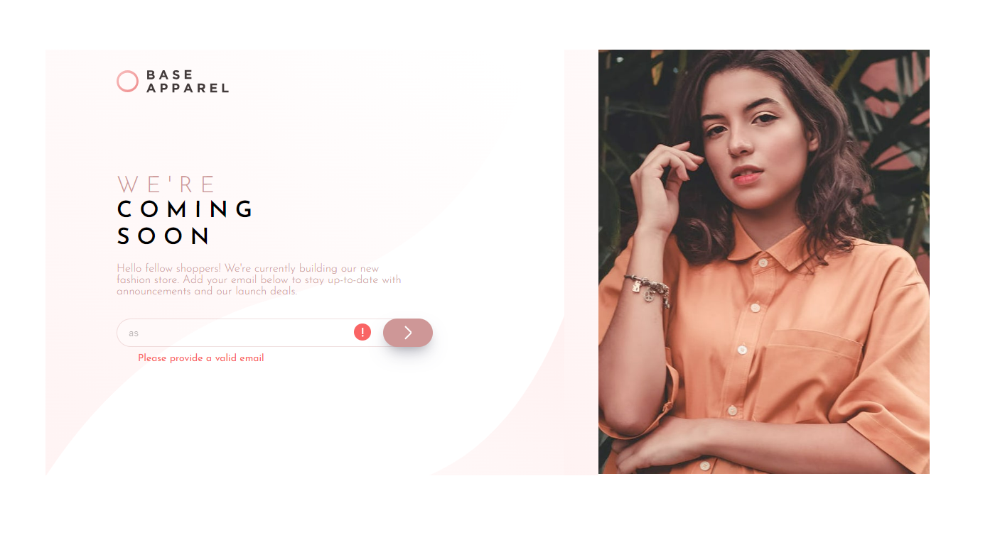

# Frontend Mentor - Base Apparel coming soon page solution

This is a solution to the [Base Apparel coming soon page challenge on Frontend Mentor](https://www.frontendmentor.io/challenges/base-apparel-coming-soon-page-5d46b47f8db8a7063f9331a0). Frontend Mentor challenges help you improve your coding skills by building realistic projects. 

## Table of contents

- [Overview](#overview)
  - [Screenshot](#screenshot)
  - [Links](#links)
- [My process](#my-process)
  - [Built with](#built-with)
  - [What I learned](#what-i-learned)
  - [Continued development](#continued-development)
  - [Useful resources](#useful-resources)
- [Author](#author)
- [Acknowledgments](#acknowledgments)

## Overview

### Screenshot

### Links

- Solution URL: [Github](https://github.com/sefaplbyk/javaScript/tree/main/Frontend-Mentor-Js/base-apparel-coming-soon-master)
- Live Site URL: [Live site](https://sefaplbyk.github.io/javaScript/Frontend-Mentor-Js/base-apparel-coming-soon-master/)

## My process

### Built with

- Semantic HTML5 markup
- CSS custom properties
- Flexbox
- CSS Grid
- Mobile-first workflow
- [Styled Components](https://styled-components.com/) - For styles

## Author

- Website - [Sefa Palabıyık](https://www.your-site.com)
- Frontend Mentor - [@sefaplbyk](https://www.frontendmentor.io/profile/sefaplbyk)
- Twitter - [@yourusername](https://www.twitter.com/yourusername)

