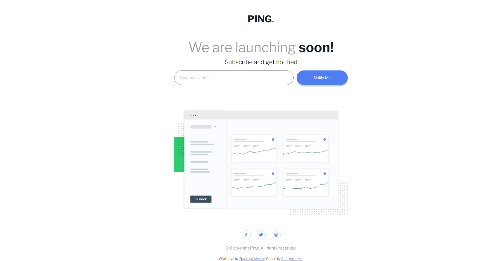

# Frontend Mentor - Intro component with sign up form solution

This is a solution to the [Intro component with sign up form challenge on Frontend Mentor](https://www.frontendmentor.io/challenges/intro-component-with-signup-form-5cf91bd49edda32581d28fd1). Frontend Mentor challenges help you improve your coding skills by building realistic projects. 

## Table of contents

- [Overview](#overview)
  - [Screenshot](#screenshot)
  - [Links](#links)
- [My process](#my-process)
  - [Built with](#built-with)
- [Author](#author)

### Screenshot

### Links

- Solution URL: [Solution](https://github.com/sefaplbyk/javaScript/tree/main/Frontend-Mentor-Js/ping-coming-soon-page-master)
- Live Site URL: [Live](https://sefaplbyk.github.io/javaScript/Frontend-Mentor-Js/ping-coming-soon-page-master/)

## My process

### Built with

- Semantic HTML5 markup
- CSS custom properties
- Flexbox
- CSS Grid
- Mobile-first workflow

## Author

- Website - [Sefa palabıyık](https://www.your-site.com)
- Frontend Mentor - [@sefaplbyk](https://www.frontendmentor.io/profile/sefaplbyk)
- Twitter - [@yourusername](https://www.twitter.com/yourusername)
